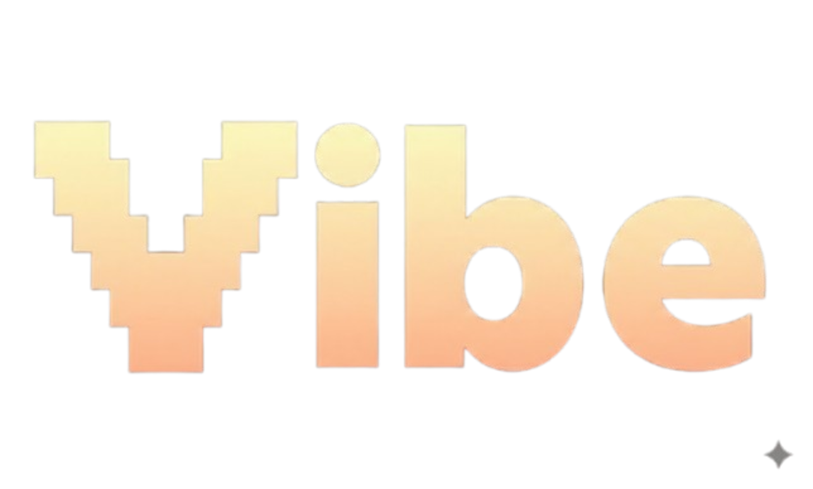

<p align="center">
  
</p>

<p align="center">
  <strong>The language to build incredible AI agents</strong>
</p>

<p align="center">
  <a href="https://www.npmjs.com/package/@vibe-lang/vibe"></a>
  <a href="https://www.npmjs.com/package/@vibe-lang/vibe"></a>
  <a href="LICENSE"></a>
</p>

<p align="center">
  <a href="#installation">Installation</a> •
  <a href="#quick-start">Quick Start</a> •
  <a href="https://vibelang.net/docs">Documentation</a> •
  <a href="#examples">Examples</a>
</p>

---

## What is Vibe?

Vibe is a domain-specific language designed for AI agent orchestration. Write declarative prompts with type safety, compose multi-step workflows, and let the runtime handle the complexity of LLM interactions. Vibe runs on a TypeScript runtime, giving you seamless access to the entire npm ecosystem.

## Installation

```bash
npm install -g @vibe-lang/vibe
# or
bun install -g @vibe-lang/vibe
```

## Quick Start

Create a `.env` file with your API key:

```env
ANTHROPIC_API_KEY=sk-ant-api03-xxxxxxxxxxxxx
```

Create `hello.vibe`:

```vibe
model translator = {
  name: "claude-haiku-4.5",
  provider: "anthropic",
  apiKey: env("ANTHROPIC_API_KEY")
}

const languages: text[] = do "List the major human languages"

for language in languages {
  const translated = do "Translate 'Hello World' into {language}"
  print(translated)
}
```

Run it:

```bash
vibe hello.vibe
```

## Features

- **Type-Safe AI Responses** — Define expected return types (`text`, `number`, `boolean`, `json`, arrays) and get validated results
- **Context Awareness** — Variables are automatically visible to AI prompts via string interpolation
- **Seamless TypeScript Interop** — Import npm packages, call TypeScript functions, embed TS blocks directly in your code
- **Automagical Async Handling** — Use `async` for parallel AI calls with automatic dependency resolution
- **Easy Custom Tool Creation** — Define tools with a simple syntax that AI models can invoke
- **Private Variables** — Mark variables as `private` to exclude them from AI context
- **Provider Agnostic** — Works with OpenAI, Anthropic, Google, and any OpenAI-compatible API

## Examples

### AI-Native Syntax

Prompts are first-class language primitives.

```vibe
// Traditional approach - verbose and clunky
const response = await openai.chat.completions.create({
  model: "gpt-5.2",
  messages: [{ role: "user", content: prompt }]
});
const answer = response.choices[0].message.content;

// Vibe - clean and expressive
const answer = do "Explain quantum computing"
```

### Strong Typing

AI calls return typed values.

```vibe
// Vibe automatically returns the right type
const count: number = do "How many planets?"
const isPrime: boolean = do "Is 17 prime?"
const tags: text[] = do "List 3 languages"

// Use them directly - no parsing needed
print(count + 1)        // 9
print(!isPrime)         // false
print(tags[0])          // "English"
```

### Seamless TypeScript Interop

Drop into TypeScript whenever you need it.

```vibe
// Embed TypeScript for complex operations
const result = ts(data) {
  const parsed = JSON.parse(data);
  return parsed.items
    .filter(item => item.score > 0.8)
    .map(item => item.name)
    .join(", ");
}

// Import from TypeScript files
import { processData } from "./utils.ts"

// Use npm packages directly
const html = ts(markdown) {
  return require('marked').parse(markdown);
}
```

### Smart Context

Automatically manages AI context windows.

```vibe
function analyze(url: text): text {
  const html = fetch(url)
  const content = do "Extract article text: {html}"
  return do "Summarize the content of the article"
}

const articles: text[] = ["https://example.com/1", "https://example.com/2"]
const summaries: text[] = []

for article in articles {
  const summary = analyze(article)
  summaries.push(summary)
} forget
```

### Custom Tools

Define tools that AI can invoke with full type safety.

```vibe
import { createIncident } from "./pagerduty.ts"

tool alertOnCall(severity: text, title: text, details: text): json
  @description "Create an incident and page the on-call engineer"
{
  ts(severity, title, details) {
    return createIncident({ severity, title, details })
  }
}

tool getMetrics(service: text, hours: number): json
  @description "Get performance metrics for a service"
{
  ts(service, hours) {
    const res = await fetch(env("METRICS_API") + "/v1/query?service=" + service + "&hours=" + hours)
    return res.json()
  }
}

model monitor = {
  name: "claude-opus-4.5",
  provider: "anthropic",
  apiKey: env("ANTHROPIC_API_KEY"),
  tools: [getMetrics, alertOnCall]
}

vibe "Check api-gateway metrics. Alert if critical."
```

### Multi-Provider Support

Switch between OpenAI, Anthropic, and Google AI.

```vibe
model gpt = {
  name: "gpt-5.2",
  provider: "openai",
  apiKey: env("OPENAI_API_KEY")
}

model haiku = {
  name: "claude-haiku-4.5",
  provider: "anthropic",
  apiKey: env("ANTHROPIC_API_KEY")
}

model gemini = {
  name: "gemini-3-pro",
  provider: "google",
  apiKey: env("GOOGLE_API_KEY")
}

const answer = do "Explain recursion"
```

### The 'vibe' Keyword

Core of agent orchestration.

```vibe
import { writeFile } from "system/tools"

model poet = {
  name: "claude-haiku-4.5",
  provider: "anthropic",
  apiKey: env("ANTHROPIC_API_KEY"),
  tools: [writeFile]
}

const topics = ["sunset", "coffee", "mountains", "rain", "stars"]

vibe "Write a poem for each topic and save to separate file"
```

### Parallel Execution

Run multiple AI calls concurrently with automatic dependency resolution.

```vibe
async let summary = do "Summarize this document"
async let keywords: text[] = do "Extract 5 keywords"
async let sentiment: text = do "What is the sentiment?"

// All three run concurrently, await automatically when used
let report = do "Create a report using: {summary}, {keywords}, {sentiment}"
```

## VS Code Extension

Get syntax highlighting and language support for `.vibe` files:

```bash
code --install-extension vibelang.vibe-language
```

## Documentation

Visit [vibelang.net/docs](https://vibelang.net/docs) for the full language guide.

## Contributing

We welcome contributions! See [CONTRIBUTING.md](CONTRIBUTING.md) for guidelines.

## License

[ISC](LICENSE)
